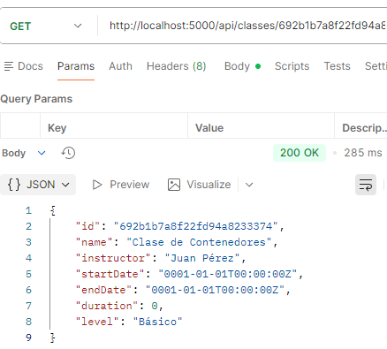
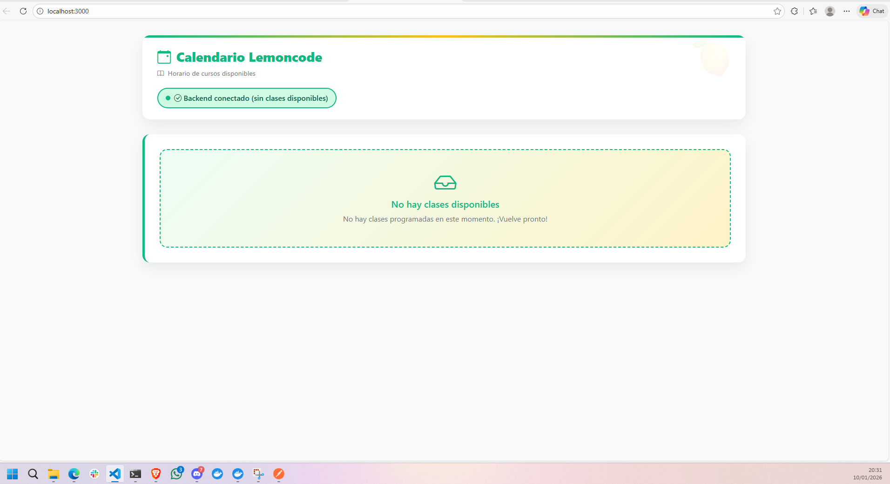

# 📝 Notas de desarrollo

A continuación se documentan los cambios y configuraciones realizados en el proyecto:

- Se ha añadido el proyecto de backend .NET.
- Se ha creado el archivo `.devcontainer/devcontainer.json` para definir el entorno de desarrollo en contenedores y facilitar la colaboración.
- Se ha añadido el archivo `.gitattributes` para normalizar los finales de línea y evitar problemas de archivos modificados entre Windows y Linux. Esto fue necesario porque, al trabajar en un Dev Container de VS Code sobre Linux y compartir el repositorio con Windows, Git mostraba archivos ya comprometidos como "modificados" sin haber realizado cambios reales. La causa son las diferencias de finales de línea (LF vs CRLF) entre sistemas operativos. Más información: [Stack Overflow](https://stackoverflow.com/questions/79582140/why-does-git-in-a-dev-container-show-old-files-as-modified-even-with-no-changes)
- Se ha añadido `.github/dependabot.yml` para automatizar la actualización de dependencias.
- Se han configurado tareas y depuración en VS Code mediante `.vscode/launch.json` y `.vscode/tasks.json`.
- Se ha creado el archivo `contenedores-02.sln` para facilitar la gestión de la solución en Visual Studio y herramientas compatibles.

# 🐳 Laboratorio Contenedores - Retos del final del módulo 🕵🏻‍♀️🫆


>[!IMPORTANT]
> Antes de lanzarte a contenerizar todo, ¡relájate y prueba la aplicación tal como está! 😌 Lo único que necesitas es tener MongoDB funcionando. Empieza con el **Reto 1** creando MongoDB en Docker. A partir de aquí ya estás list@ para comprobar lo que has aprendido.

## 🎯 Los 4 Retos

El objetivo es tener esta aplicación funcionando completamente en contenedores, la cual es un calendario de las clases de Lemoncode 🍋🗓️


La misma aplicación está disponible en dos stacks tecnológicos diferentes para el backend: .NET y Node.js. El frontend es idéntico en ambos casos. ¡Tú eliges cuál usar! 

Está compuesta de tres componentes principales:

- 🌐 **Frontend**: Una interfaz con Node.js
- ⚙️ **Backend**: Elige tu aventura - .NET (`dotnet-stack`) o Node.js (`node-stack`) que se conecta con MongoDB
- 🗄️ **Base de datos**: MongoDB para almacenar toda la información

> 💡 **¡Libertad de elección!** Como habrás notado, tienes dos carpetas: `dotnet-stack` y `node-stack`. El frontend es idéntico en ambos casos, solo cambia el backend. ¡Elige el que más te motive! O puedes hacer las dos si quieres.

---

### 🔥 Reto 1: MongoDB en Contenedor

**Objetivo**: Ejecutar MongoDB dentro de un contenedor y conectar el backend (ejecutándose localmente) para que pueda recuperar, crear, modificar y eliminar clases de la base de datos.

#### 📋 Requisitos:
1. ✅ Crear una red Docker para la comunicación
2. ✅ Ejecutar MongoDB en un contenedor con persistencia de datos
4. ✅ Ejecutar el backend localmente conectándose a tu nuevo MongoDB
5. ✅ Verificar que el CRUD funciona correctamente usando la extensión REST Client y el archivo `backend/client.http` del stack que hayas elegido
6. ✨ Puedes instalar la extensión de [MongoDB for VS Code](https://marketplace.visualstudio.com/items?itemName=mongodb.mongodb-vscode) o usar MongoDB Compass para verificar que los datos se almacenan correctamente

¡Perfecto! Si has llegado hasta aquí, ya tienes MongoDB corriendo en un contenedor y tu backend puede comunicarse con él. ¡Buen trabajo! 🎉

---

### 🐳 Reto 2: Dockerizar el Backend

**Objetivo**: Crear un Dockerfile para el backend y ejecutarlo en contenedor, conectado a MongoDB via red Docker.

#### 📋 Requisitos:
1. ✅ Crear un Dockerfile para el backend (para .NET para o Node.js)
2. ✅ Construir la imagen del backend
3. ✅ Ejecutar el backend en un contenedor en la red Docker que creaste en el Reto 1
4. ✅ Verificar que se conecta correctamente a MongoDB
5. ✅ Exponerse el puerto 5000 para que sea accesible

#### 💡 Tips:
- Define variables de entorno adecuadas para la conexión a MongoDB
- Asegúrate de que la imagen sea lo más eficiente posible
- Usa puertos correctos (5000 para la API)

---

### 🎨 Reto 3: Dockerizar el Frontend

**Objetivo**: Crear un Dockerfile para el frontend y ejecutarlo en contenedor, conectado al backend via red Docker.

#### 📋 Requisitos:
1. ✅ Crear un Dockerfile para el frontend
2. ✅ Construir la imagen del frontend
3. ✅ Ejecutar el frontend en un contenedor en la red Docker
4. ✅ Configurar las variables de entorno para conectarse al backend en `http://topics-api:5000/api/classes`
5. ✅ Acceder a la interfaz desde el navegador en el puerto 3000

#### 💡 Tips:
- El frontend debe ser accesible desde http://localhost:3000
- Configura las variables de entorno para apuntar al backend correcto
- A través de los terminales de ambos componentes, e incluso desde la propia web podrás verificar que todo funciona correctamente

---

### 🎪 Reto 4: Docker Compose - Todo Junto

**Objetivo**: Usar Docker Compose para orquestar todos los servicios (MongoDB, Backend, Frontend) como un director de orquesta.

#### 📋 Requisitos:
1. ✅ Crear un `compose.yml` que incluya los tres servicios
2. ✅ Configurar la red compartida `lemoncode-network`
3. ✅ Definir volumen para persistencia de MongoDB
4. ✅ Establecer todas las variables de entorno necesarias
5. ✅ Exponer los puertos correctos (3000 para frontend, 5000 para API, 27017 para MongoDB)
6. ✅ Definir dependencias entre servicios
7. ✅ Levantar toda la aplicación con un único comando
8. ✅ Acceder a la aplicación desde el navegador en http://localhost:3000 

#### 💡 Tips:
- Usa `depends_on` para ordenar el inicio de los servicios
- Mapea el volumen para persistencia de datos
- Define claramente las variables de entorno para cada servicio
- Documenta los comandos útiles (up, down, logs, etc.)


### Entregables

#### 📦 Reto 1: MongoDB en Contenedor
1. ✅ Comandos utilizados para crear la red Docker
- ```docker network create lemoncode-network```
2. ✅ Comando para ejecutar el contenedor de MongoDB
- ```docker run -d -p 27017:27017 -v mongo-data:/data/db --name mongodb --network lemoncode-network mongo:8.2.1```
3. ✅ Configuración de conexión del backend a MongoDB
4. ✅ Prueba REST Client mostrando peticiones exitosas (`backend/client.http`)


#### 🐳 Reto 2: Dockerizar el Backend
1. ✅ Archivo `Dockerfile` del backend 
2. ✅ Comando para construir la imagen 
```docker build -t backend-app ./backend```
3. ✅ Comando para ejecutar el contenedor del backend
```docker run -d --name backend-dotnet --network lemoncode-network -p 5000:5000 backend-dotnet```
4. ✅ Prueba REST Client validando que la API responde correctamente

#### 🎨 Reto 3: Dockerizar el Frontend
1. ✅ Archivo `Dockerfile` del frontend
2. ✅ Comando para construir la imagen del frontend
```docker build -t frontend-app .```
3. ✅ Comando para ejecutar el contenedor del frontend
```docker run -d --name frontend-app --network lemoncode-network -p 3000:3000 --env-file .env frontend-app```
4. ✅ Archivo `.env` o variables de entorno configuradas correctamente



#### 🎪 Reto 4: Docker Compose
1. ✅ Archivo `compose.yml` completo y documentado con comentarios
2. ✅ Archivo `.env` (si es necesario) con variables de entorno
3. ✅ Comando `docker-compose up` ejecutándose exitosamente
4. ✅ Captura de pantalla de todos los servicios corriendo (`docker-compose ps`)
5. ✅ Captura de pantalla de la aplicación completa en `http://localhost:3000`
